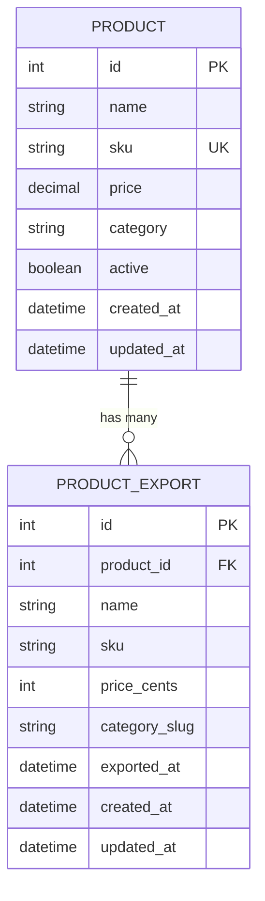

# Design Document - Data Models

## Overview

This design document outlines the implementation of the Product and ProductExport models for the Rails 8 demo application. The models follow Rails conventions and ActiveRecord patterns to provide a robust foundation for the product catalog synchronization use case. The design emphasizes data integrity, query performance, and ease of use for DataFlow processing.

## Architecture

### Model Layer Architecture

```
┌─────────────────────────────────────────────────────────┐
│                    Application Layer                     │
│              (Controllers, DataFlows, Jobs)              │
└─────────────────────────────────────────────────────────┘
                            │
                            ▼
┌─────────────────────────────────────────────────────────┐
│                      Model Layer                         │
│  ┌──────────────────┐         ┌──────────────────────┐  │
│  │  Product Model   │◄────────│ ProductExport Model  │  │
│  │                  │ 1:many  │                      │  │
│  │  - Validations   │         │  - Validations       │  │
│  │  - Scopes        │         │  - Associations      │  │
│  │  - Helpers       │         │  - Scopes            │  │
│  └──────────────────┘         └──────────────────────┘  │
└─────────────────────────────────────────────────────────┘
                            │
                            ▼
┌─────────────────────────────────────────────────────────┐
│                    Database Layer                        │
│  ┌──────────────────┐         ┌──────────────────────┐  │
│  │ products table   │         │ product_exports      │  │
│  │                  │         │ table                │  │
│  │  - Indexes       │         │  - Indexes           │  │
│  │  - Constraints   │         │  - Foreign Keys      │  │
│  └──────────────────┘         └──────────────────────┘  │
└─────────────────────────────────────────────────────────┘
```

### Design Principles

1. **Convention over Configuration**: Follow Rails naming conventions and defaults
2. **Data Integrity**: Use database constraints and model validations
3. **Performance**: Add strategic indexes for common query patterns
4. **Simplicity**: Keep models focused on data representation and basic business logic
5. **Testability**: Design models to be easily testable in isolation

## Components and Interfaces

### Product Model

**File**: `app/models/product.rb`

**Responsibilities**:
- Represent product catalog data
- Validate product attributes
- Provide query scopes for filtering
- Offer helper methods for computed values
- Define relationship to ProductExport

**Public Interface**:

```ruby
class Product < ApplicationRecord
  # Associations
  has_many :product_exports, dependent: :destroy
  
  # Validations
  validates :name, presence: true, length: { maximum: 255 }
  validates :sku, presence: true, uniqueness: true
  validates :price, presence: true, numericality: { greater_than_or_equal_to: 0 }
  
  # Scopes
  scope :active, -> { where(active: true) }
  scope :inactive, -> { where(active: false) }
  scope :by_category, ->(category) { where(category: category) }
  scope :recent, -> { order(created_at: :desc) }
  scope :price_range, ->(min, max) { where(price: min..max) }
  
  # Instance Methods
  def price_in_cents
  def category_slug
  def display_name
  def active?
end
```

### ProductExport Model

**File**: `app/models/product_export.rb`

**Responsibilities**:
- Represent exported product data
- Validate export attributes
- Define relationship to Product
- Provide query scopes for export analysis
- Support bulk operations

**Public Interface**:

```ruby
class ProductExport < ApplicationRecord
  # Associations
  belongs_to :product
  
  # Validations
  validates :product_id, presence: true
  validates :name, presence: true
  validates :sku, presence: true
  validates :price_cents, presence: true, numericality: { greater_than_or_equal_to: 0 }
  validates :exported_at, presence: true
  
  # Scopes
  scope :recent_exports, -> { order(exported_at: :desc) }
  scope :exported_today, -> { where(exported_at: Time.current.beginning_of_day..Time.current.end_of_day) }
  scope :by_product, ->(product_id) { where(product_id: product_id) }
  
  # Class Methods
  def self.total_value
  def self.export_count_by_category
end
```

## Data Models

### Database Schema

#### products table

```ruby
create_table :products do |t|
  t.string :name, null: false, limit: 255
  t.string :sku, null: false, limit: 100
  t.decimal :price, precision: 10, scale: 2, null: false
  t.string :category, limit: 100
  t.boolean :active, default: true, null: false
  
  t.timestamps
end

# Indexes
add_index :products, :sku, unique: true
add_index :products, :active
add_index :products, [:category, :active]
```

**Rationale**:
- `name` limited to 255 chars (standard varchar limit)
- `sku` limited to 100 chars (typical SKU length)
- `price` uses decimal(10,2) for precise monetary values
- `active` defaults to true for new products
- Composite index on `[category, active]` optimizes common filter queries

#### product_exports table

```ruby
create_table :product_exports do |t|
  t.integer :product_id, null: false
  t.string :name, null: false, limit: 255
  t.string :sku, null: false, limit: 100
  t.integer :price_cents, null: false
  t.string :category_slug, limit: 100
  t.datetime :exported_at, null: false
  
  t.timestamps
end

# Indexes
add_index :product_exports, :product_id
add_index :product_exports, :exported_at
add_index :product_exports, [:product_id, :exported_at]

# Foreign Keys
add_foreign_key :product_exports, :products
```

**Rationale**:
- `product_id` references products table with foreign key constraint
- `price_cents` stores integer cents for precise calculations
- `exported_at` indexed for time-based queries
- Composite index on `[product_id, exported_at]` optimizes export history queries
- Foreign key ensures referential integrity

### Entity Relationship Diagram



## Implementation Details

### Validations Strategy

**Product Model Validations**:
1. **Presence validations**: Ensure required fields (name, sku, price) are present
2. **Uniqueness validation**: Prevent duplicate SKUs at application level
3. **Numericality validation**: Ensure price is non-negative
4. **Length validations**: Prevent excessively long strings

**ProductExport Model Validations**:
1. **Presence validations**: Ensure all required fields are present
2. **Association validation**: Ensure product_id references valid Product
3. **Numericality validation**: Ensure price_cents is non-negative

### Query Optimization

**Indexing Strategy**:
- Single-column indexes for foreign keys and frequently filtered columns
- Composite indexes for common multi-column queries
- Unique indexes for business key constraints (SKU)

**N+1 Query Prevention**:
```ruby
# Eager load associations when needed
Product.includes(:product_exports).active

# Use joins for filtering without loading associations
Product.joins(:product_exports).where(product_exports: { exported_at: Date.today })
```

### Bulk Operations

**Efficient Batch Processing**:
```ruby
# Batch insertion
ProductExport.insert_all(export_records, returning: false)

# Batch updates
Product.where(category: 'Old').update_all(category: 'New')

# Memory-efficient iteration
Product.find_each(batch_size: 100) do |product|
  # Process product
end
```

### Helper Methods Implementation

**Product#price_in_cents**:
```ruby
def price_in_cents
  (price * 100).to_i
end
```

**Product#category_slug**:
```ruby
def category_slug
  category&.parameterize || 'uncategorized'
end
```

**Product#display_name**:
```ruby
def display_name
  "#{name} (#{sku})"
end
```

## Error Handling

### Validation Errors

**Strategy**: Use ActiveRecord validation errors for user-facing feedback

```ruby
product = Product.new(name: nil)
if product.save
  # Success
else
  product.errors.full_messages # ["Name can't be blank"]
end
```

### Database Constraint Violations

**Strategy**: Catch database-level errors and provide meaningful messages

```ruby
begin
  Product.create!(sku: existing_sku)
rescue ActiveRecord::RecordNotUnique => e
  # Handle duplicate SKU error
  Rails.logger.error("Duplicate SKU: #{e.message}")
end
```

### Association Errors

**Strategy**: Validate associations before save operations

```ruby
export = ProductExport.new(product_id: 999999)
export.valid? # false
export.errors[:product] # ["must exist"]
```

## Testing Strategy

### Unit Tests

**Product Model Tests** (`test/models/product_test.rb`):
- Test validations (presence, uniqueness, numericality)
- Test scopes (active, inactive, by_category, price_range)
- Test helper methods (price_in_cents, category_slug, display_name)
- Test associations (has_many product_exports)

**ProductExport Model Tests** (`test/models/product_export_test.rb`):
- Test validations (presence, numericality)
- Test associations (belongs_to product)
- Test scopes (recent_exports, exported_today, by_product)
- Test class methods (total_value, export_count_by_category)

### Integration Tests

**Database Constraint Tests**:
- Test unique constraint on SKU
- Test foreign key constraint on product_id
- Test null constraints on required fields

**Performance Tests**:
- Test query performance with large datasets
- Test bulk operation efficiency
- Test N+1 query prevention

### Test Data Fixtures

```ruby
# test/fixtures/products.yml
active_product:
  name: "Test Product"
  sku: "TEST-001"
  price: 29.99
  category: "Electronics"
  active: true

inactive_product:
  name: "Inactive Product"
  sku: "TEST-002"
  price: 19.99
  category: "Electronics"
  active: false
```

## Migration Strategy

### Initial Migrations

1. **Create products table**: Define schema with constraints and indexes
2. **Create product_exports table**: Define schema with foreign keys
3. **Add additional indexes**: Add composite indexes for optimization

### Future Migrations

**Adding new fields**:
```ruby
class AddDescriptionToProducts < ActiveRecord::Migration[8.1]
  def change
    add_column :products, :description, :text
  end
end
```

**Adding new indexes**:
```ruby
class AddIndexToProductsCategory < ActiveRecord::Migration[8.1]
  def change
    add_index :products, :category
  end
end
```

## Performance Considerations

### Query Performance

- Use `select` to limit columns when full records aren't needed
- Use `pluck` for single-column queries
- Use `exists?` instead of `any?` for existence checks
- Use database-level aggregations (count, sum) instead of loading records

### Memory Management

- Use `find_each` for large result sets
- Avoid loading unnecessary associations
- Use `delete_all` instead of `destroy_all` when callbacks aren't needed

### Caching Strategy

```ruby
# Cache expensive computations
def expensive_calculation
  Rails.cache.fetch("product_#{id}_calculation", expires_in: 1.hour) do
    # Expensive operation
  end
end
```

## Security Considerations

### Mass Assignment Protection

Use strong parameters in controllers:
```ruby
def product_params
  params.require(:product).permit(:name, :sku, :price, :category, :active)
end
```

### SQL Injection Prevention

Always use parameterized queries:
```ruby
# Good
Product.where("price > ?", min_price)

# Bad - vulnerable to SQL injection
Product.where("price > #{min_price}")
```

## Monitoring and Observability

### Logging

Log important model operations:
```ruby
after_create :log_creation

def log_creation
  Rails.logger.info("Product created: #{display_name}")
end
```

### Metrics

Track model-level metrics:
- Product creation rate
- Export success rate
- Average export processing time
- Failed validation counts

## Future Enhancements

1. **Soft Deletes**: Add `deleted_at` column for soft delete functionality
2. **Versioning**: Integrate PaperTrail for audit trail
3. **Full-Text Search**: Add pg_search for product search
4. **Tagging**: Add acts-as-taggable for flexible categorization
5. **Images**: Add ActiveStorage for product images
